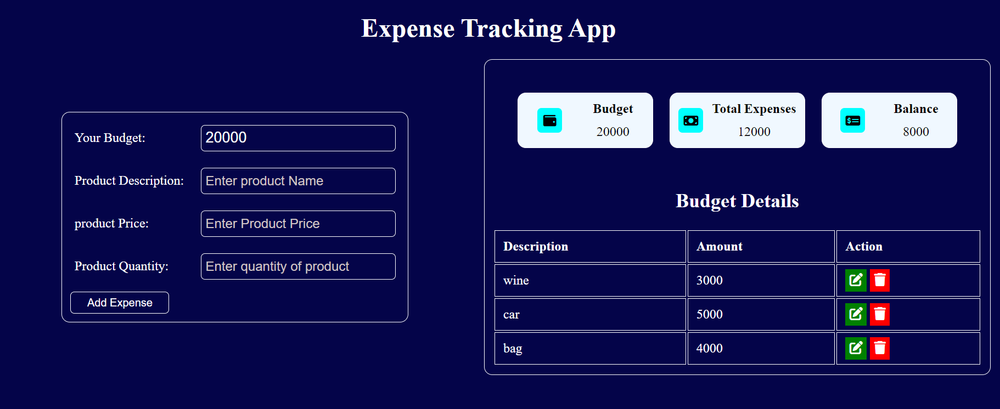

## 1. Expense Tracking App

Hello, this file contains a concise description on how to use my Expense tracking App.
This project was built, using Html, CSS and javascript(manipulating the DOM)

### 2. Key points
- How to add a budgetted amount
- How to add an expense(s)
- How to edit already logged expense
- How to delete an expense

### 2a. How to add a budgetted Amount
* To add a budgetted amount, click on the box directly infront of **Your budget** text
  and type in your budget. You can click on the *Add expense* button immediately, to add your budget or wait to fill in the rest of the provided spaces before clicking the *Add Expense* button.

* mobile View

* Desktop View

### 2b. How to add an expense
* To add an expense, fill in the spaces provided for product description, price and quantity, then click on the **add Expense** button to log an expense as shown below:

* Image of expense details after adding an expense is shown below:

* In order to add more expenses, just fill the spaces for product description, price and quantity and leave the already filled budget price, then click the **add Expense** button to add another expense .

### 2c. How to edit already logged expense
* To **edit** already logged expense, you need to first fill the product description, price and quantity, before clicking on the edit button.
**Note**: fill these required spaces just the way you add your expenses but instead of clicking on the **Add Expense**, you click on the **edit button** as shown below:

* first fill the spaces as shown below:

* Then click on the edit button as shown below:

* Result of edited expense is shown below:

### 3d. How to delete an expense

* To delete an expense, all you need to do is to click on the delete button of the expense to be deleted, just as shown in the image below:

* clicking on delete button

* Remaining expense list after deleting an expense

* You can find the link to this project here: **VercelLink** <https://expense-tracker-chi-umber.vercel.app/>

